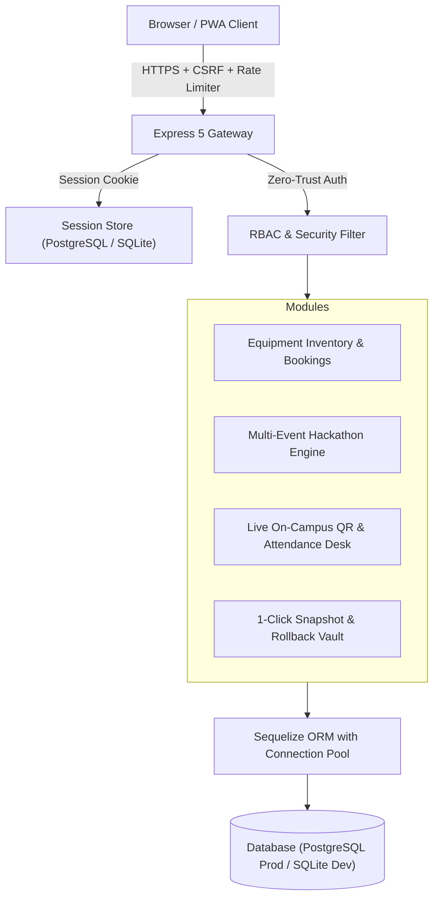

# AICTE IDEA Lab — Architecture & System Design Document

## 1. System Overview
The AICTE IDEA Lab web platform at Kumaraguru College of Technology is a high-availability, high-performance web sanctuary engineered for digital fabrication laboratory management, equipment inventory bookings, nationwide multi-hackathon management, and live on-campus event telemetry.

## 2. Threat Model & Zero-Trust Security Boundary
1. **Universal Backdoor Eradication:**
   - Insecure development auto-passwords, universal bypass credentials, and master passkeys have been completely removed.
   - User authentication strictly relies on bcrypt salted password hashing with work factor 10.
2. **Elimination of Client-Controlled Role Injection:**
   - Client-supplied headers (such as `x-hackathon-user`) are completely rejected by the security layer.
   - User identities and role claims (`student`, `admin`, `mentor`, `reviewer`) are read solely from cryptographically signed, HTTP-only server sessions.
3. **Double-Submit Cookie CSRF Protection:**
   - A cryptographically random token is generated per session in a readable cookie (`XSRF-TOKEN`).
   - Every mutating request (`POST`, `PUT`, `PATCH`, `DELETE`) must transmit this token via `x-csrf-token`.
   - The backend validates tokens in timing-safe constant time.
   - If a token desynchronizes, the Axios client automatically performs a transparent 403 self-healing retry.
4. **Adaptive Rate Limiting & Account Lockout:**
   - In-memory sliding-window limiters throttle brute-force attacks on auth endpoints (15 req/15min).
   - 5 consecutive failed login attempts lock the targeted email for 15 minutes.
5. **Content Security Policy & Permissions Policy:**
   - Strict Helmet CSP eliminates inline code execution and unauthorized script CDNs.
   - Camera access is granted strictly to `'self'` for the volunteer HTML5 QR code scanner.

## 3. Database Engine & Dialect Parity
The platform supports dual-database operation:
- **Local Host Development:** SQLite (`database_multi_hackathon.sqlite`) with SQLite PRAGMA introspection for zero-setup execution.
- **Production Staging & Deployments:** PostgreSQL with connection pooling (`min: 2, max: 15`).
- Composite performance indexes accelerate lookup queries on team codes, user memberships, submission phases, and OTP expiration.

## 4. Multi-Hackathon & Volunteer Check-In Portal
- The platform hosts multiple concurrent events identified by unique slugs.
- Dynamic team QR passes encode team identity and invite tokens.
- The volunteer portal captures real-time QR camera feeds, validates team rosters, and assigns lab benches (`BENCH-A01`) with live attendance auditing.
